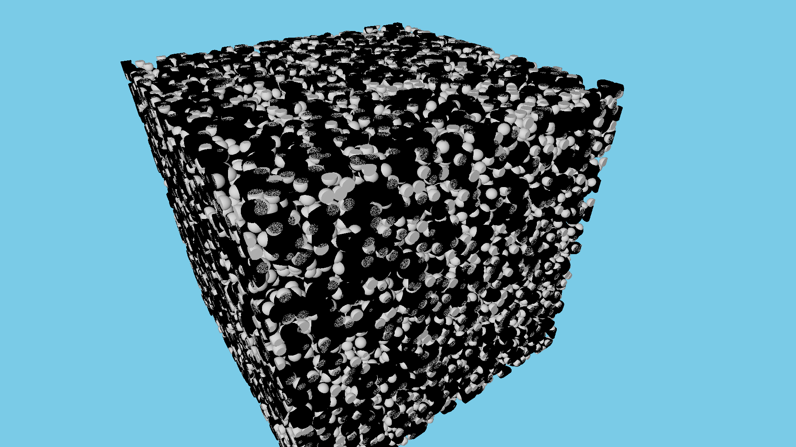
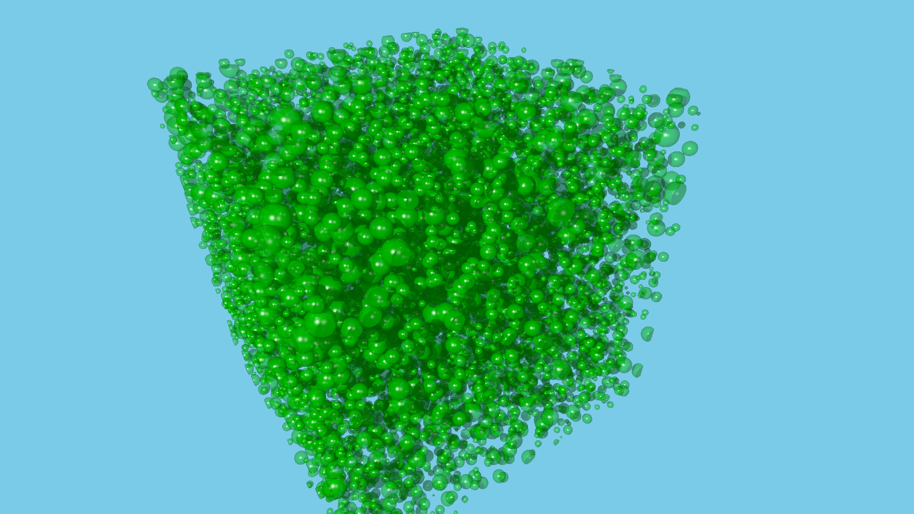
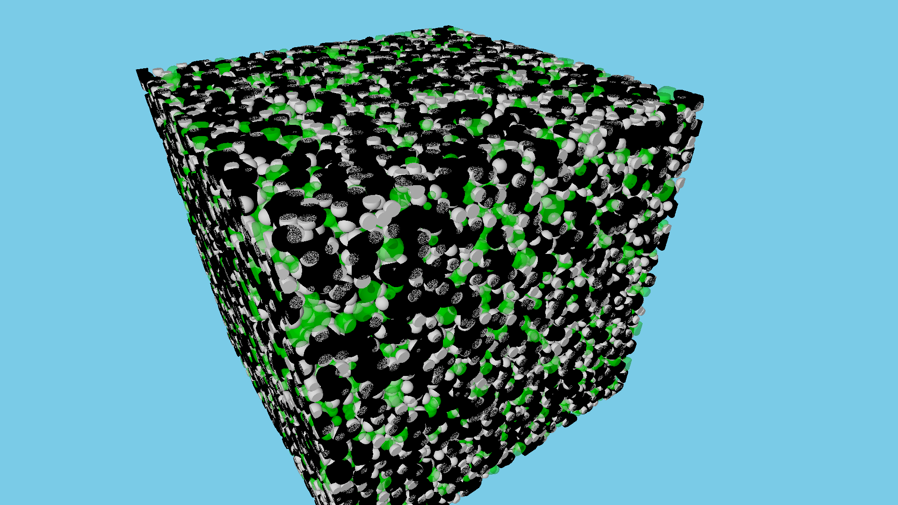
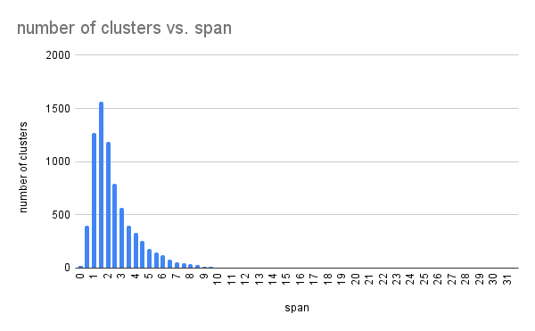
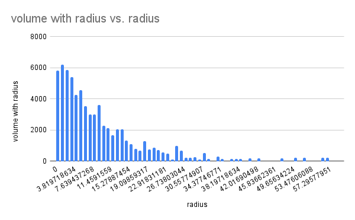
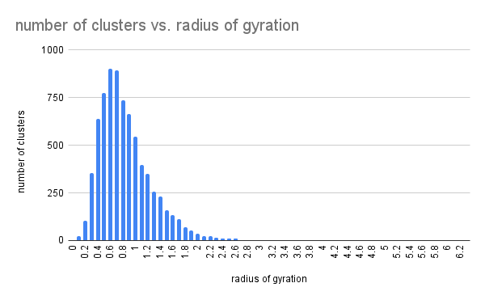
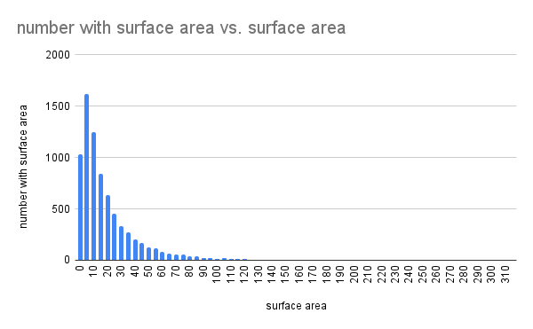

# Project files

- scripts: bash scripts used to transform original data to generate outputs here
- generated_files: intermediate statistics and files generated by the scripts
- images: Final graphs and rendered molecular and free volume scene images shown below
- original_files: original input params and sample configuration

## Original polystyrene example

## Cavities in sample

## Sample plus cavities

## Free Volume Index (rendered from VACUUMMS-generated TIFF as input to Paraview)

Paraview TIFFScalar mapping to xray preset

Paraview TIFFScalar mapping to blue-green-orange preset

## Cavity size distribution, count vs. volume

## Cavity size distribution, count vs. diameter

## Cavity clusters, number of clusters vs. span

## Cavity size distribution, volume vs. radius

## Cavity cluster distribution, number of clusters vs. radius of gyration  

## Cavity clusters, number vs. surface area

Much thanks to Janani Sampath and her research group for contributing the original simulated polystyrene configuration. 
